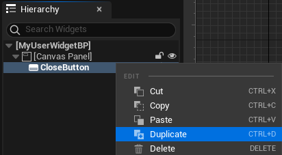
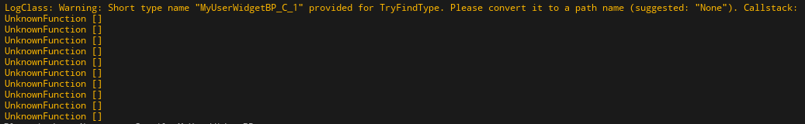

# 测试工程：关于 FMulticastDelegate 类型属性导出和导入的问题

## 引擎版本

本工程使用的引擎版本是 **5\.2\.1\-26001984** ，来源于 Epic Launcher

## 工程说明

推荐使用 **UE5\.2** 运行该工程，以便复现问题。考虑到相关引擎源码在 UE5\.3 中不变，理论上使用 UE5\.3 也能复现问题。

## 复现方式

按照以下步骤操作，可以 **稳定** 复现问题：

1. 打开 Content 目录下的 **MyUserWidgetBP** 蓝图

2. 复制其中的 **CloseButton** 控件，即可复现问题

    

3. 在日志窗口中可以看到对应的警告；如果引擎含有 pdb 文件就会得到更加详细的堆栈信息

    
