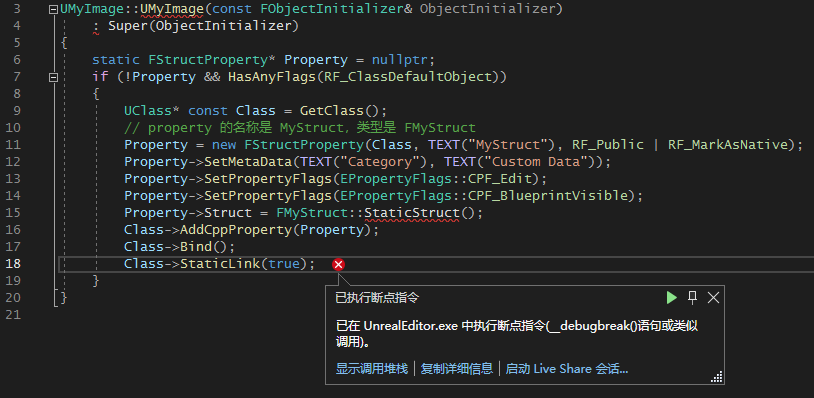
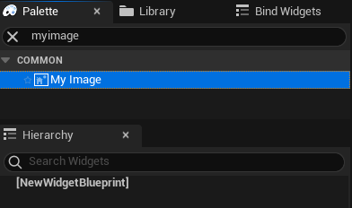
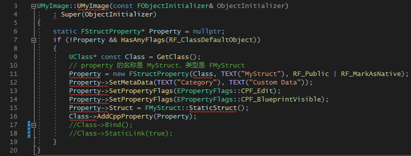

# 测试工程：动态向 C++ 的 UClass 添加 UProperty

## 引擎版本

5\.1\.1

## 问题复现方式

按照以下步骤操作，可以 **稳定** 复现问题。

问题一：

1. **不改动** 现有的代码，直接编译项目，启动 UE 编辑器

2. 在 UE 编辑器启动至 75% 时，会触发一个断点错误

    

3. 跳过断点后，可以正常打开 UE 编辑器

4. 新建一个 Widget Blueprint，在 Palette 窗口中选择 **MyImage**，将其拖拽至 Hierarchy 窗口下

    

5. 此时会触发严重的 C\+\+ 错误，而且无法跳过

问题二：

1. 打开 MyImage\.cpp，去除 `Bind` 和 `StaticLink` 函数的调用

    

2. 编译项目，启动 UE 编辑器，此时可以正常打开 UE 编辑器

3. 新建一个 Widget Blueprint，在 Palette 窗口中选择 **MyImage**，将其拖拽至 Hierarchy 窗口下

    

4. Hierarchy 窗口下可以正常创建 MyImage 的节点，然而选中 MyImage 节点时，会触发严重的 C\+\+ 错误，而且无法跳过
