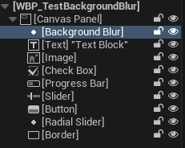
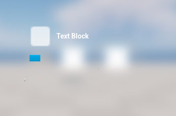
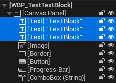
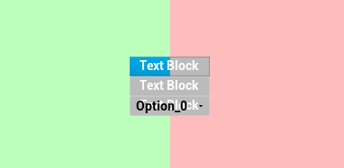

# 测试工程：关于 Slate 的渲染流程

## 引擎版本

本工程使用的引擎版本是 5.4.3-34507850 ，来源于 Epic Launcher

## 问题说明

### 1. 背景模糊（BackgroundBlur）总是显示在上层

打开 Content/UserWidget 目录下的 WBP\_TestBackgroundBlur，可以看到背景模糊控件位于控件树（Widget Tree）的最底层，却遮挡了其他大部分的控件。而且无论如何调整背景模糊控件的层级，它都始终拥有较高的显示顺序。

打开 Content/Map 目录下的 TestBackgroundBlur，运行游戏，可以查看运行时的情况。

### 2. 文本（TextBlock）总是显示在上层

打开 Content/UserWidget 目录下的 WBP\_TestTextBlock，可以看到三个文本控件位于控件树的最底层，却遮挡了其他大部分的控件。而且无论如何调整这三个文本控件的层级，它们都始终拥有较高的显示顺序。

打开 Content/Map 目录下的 TestTextBlock，运行游戏，可以查看运行时的情况。

